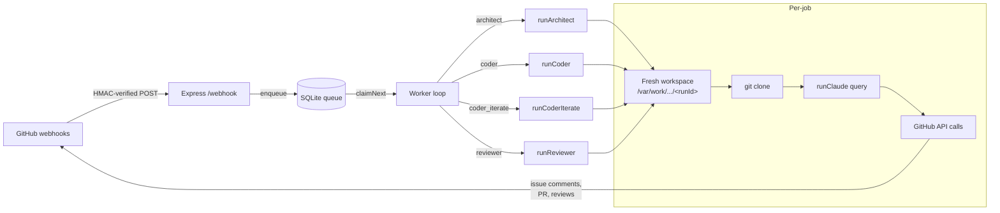
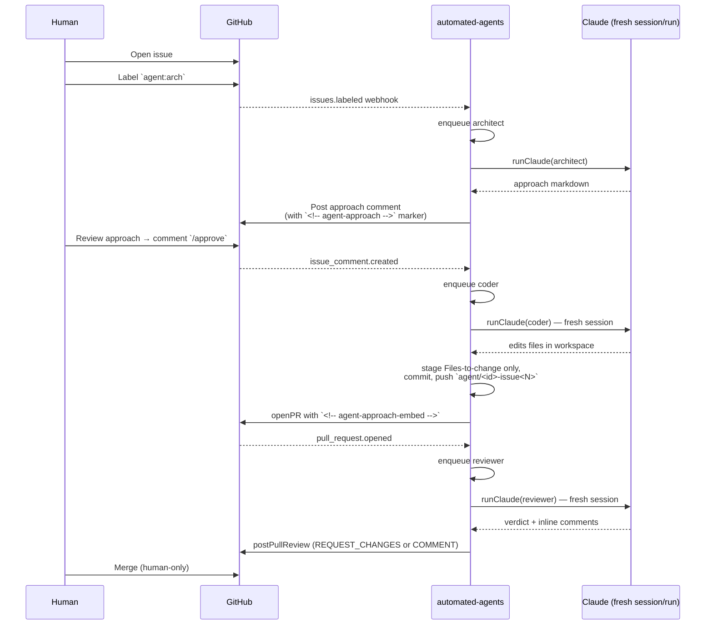
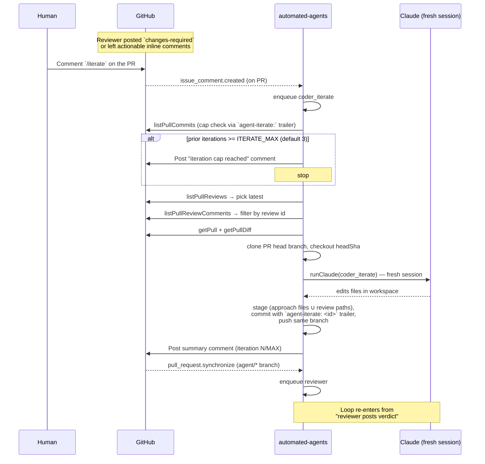
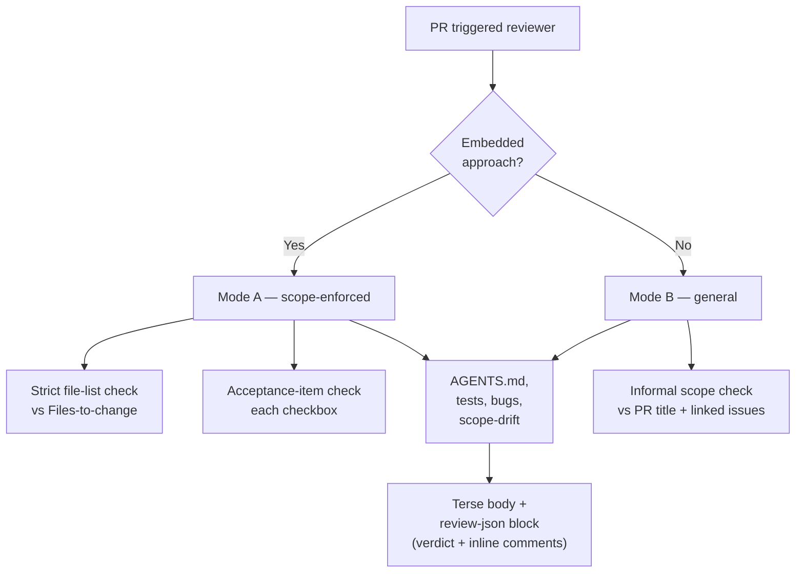

# Agentic Flow

How this service turns GitHub events into agent-driven code changes, and
what guarantees it holds.

---

## What this is

A single Node/TypeScript service (`automated-agents`) that listens for
GitHub webhook events against a target repo and dispatches three roles —
**architect**, **coder**, **reviewer** — each implemented as a fresh
Claude Code subprocess (via `@anthropic-ai/claude-agent-sdk`).

One process, one SQLite-backed queue, one-job-at-a-time worker. Every
role spawns a new Claude session — there is no shared conversation
state between jobs or between roles.

---

## Components



---

## Trigger matrix

| Event | Condition | Role | Notes |
|---|---|---|---|
| `issues.labeled` | label = `agent:arch` | architect | Reads issue → posts approach comment with `<!-- agent-approach run=<id> -->` |
| `issue_comment.created` (on **issue**) | body starts with `/approve` | coder | Finds latest approach + branch `agent/<id>-issue<N>` → opens PR |
| `issue_comment.created` (on **PR**) | body starts with `/iterate` | coder_iterate | Fresh Claude session addresses latest review; pushes to **same** branch |
| `pull_request.opened` / `reopened` | branch starts with `agent/` | reviewer | Bot PRs auto-reviewed |
| `pull_request.labeled` | label = `agent:review` | reviewer | Humans opt in their own PRs (Mode B) |
| `pull_request.synchronize` | branch starts with `agent/` | reviewer | New commits on bot PR → auto re-review (closes the iterate loop) |

Draft PRs are skipped in all `pull_request` branches.

---

## Happy path (fresh issue → merged PR)



---

## Iterate loop (Phase 4)



**Why fresh sessions matter:** every `/iterate` invocation rebuilds its
context from GitHub artifacts (PR body, embedded approach, latest review,
current diff) — not from the original coder's memory. No `--resume`.
This is why you can safely run many iteration cycles without cross-run
interference.

---

## Reviewer modes

The reviewer runs the same prompt skeleton against every PR, but adapts
based on whether the PR body contains an embedded `<!-- agent-approach-embed -->`
block:



| Mode | Trigger | Scope signal | Strictness |
|---|---|---|---|
| A — scope-enforced | Bot PR on `agent/*` branch with embedded approach | `Files to change` list = hard authorized set | Extras = scope drift → `changes-required` |
| B — general | Human PR with `agent:review` label | PR title + `Closes #N` / `Fixes #N` linked issue bodies | Informal "does the diff match what the PR claims?" |

Both modes emit the same output shape: a 2–4 sentence markdown body
(verdict first), then a `<!-- review-json -->` block carrying the
machine-readable verdict + inline comments array.

---

## Session isolation

Each `runClaude()` call in `src/lib/claude.ts` creates a brand-new
Claude subprocess via the Agent SDK — new `session_id`, no `--resume`,
no `--continue`. This is a hard guarantee enforced at the code level,
not a convention:

- **Between roles:** architect, coder, reviewer each run their own
  process. Nothing flows between them except GitHub artifacts
  (issue comments, PR body, diff).
- **Between runs of the same role:** every `/iterate` spawns a fresh
  coder session; every `pull_request.synchronize` spawns a fresh
  reviewer session.
- **Workspace isolation:** `newWorkspace()` creates a unique temp
  directory per run (`/var/work/automated-agents/<runId>/`) and
  wipes it in a `finally` block. No cross-run file reuse.
- **Concurrency:** the worker processes one job at a time — no
  two Claude sessions share the host state simultaneously.

Context for an iteration run is rebuilt from the GitHub API on every
invocation (PR body, embedded approach, latest review filtered by
`pull_request_review_id`, current diff).

---

## Caps + fail-safes

| Control | Where | What it does |
|---|---|---|
| `ITERATE_MAX` (default 3) | `config.maxIterations` | Cap on `/iterate` cycles. Counted via `agent-iterate:` trailer scan on PR commits. 4th trigger posts a "cap reached" comment and returns. |
| File-list staging | `src/lib/gitops.ts::stageTargets` | Coder only stages files in the approach's `Files to change` list (plus inline-referenced paths in iterate). Scope leakage is logged and **not** committed. |
| `REQUEST_CHANGES` self-PR downgrade | `src/lib/github.ts::postPullReview` | GitHub blocks REQUEST_CHANGES on your own PR; reviewer auto-retries as COMMENT and appends a note. Verdict stays visible in the body. |
| LGTM default on parse failure | `src/roles/reviewer.ts::parseReviewOutput` | If `<!-- review-json -->` is missing or invalid, default to `lgtm` to avoid cascading 422s. Reviewer never claims "approved" — `lgtm` means "no blocking concerns, human decides". |
| Webhook HMAC | `src/webhook.ts` | Rejects any POST without a valid `x-hub-signature-256` matching the shared secret. |
| Draft PR skip | `src/main.ts` | Reviewer will not fire on draft PRs, under any trigger. |

---

## File map (what lives where)

```
src/
├── main.ts                 # Express webhook + routes
├── worker.ts               # Queue polling + role dispatch
├── config.ts               # Env-var loader (models, caps, paths)
├── types.ts                # JobKind, payloads
├── webhook.ts              # HMAC verification
│
├── queue/
│   └── sqlite.ts           # better-sqlite3-backed job queue
│
├── lib/
│   ├── claude.ts           # runClaude() — one SDK query per call
│   ├── github.ts           # Octokit wrappers (issue/PR/review/comments)
│   ├── workspace.ts        # Fresh clone + cleanup per run
│   ├── gitops.ts           # Thin git wrappers (stage/commit/push)
│   └── approach.ts         # Parse approach.md → Files-to-change list
│
├── prompts/
│   ├── architect.ts        # Architect system + user prompts, TERSE_DISCIPLINE
│   ├── coder.ts            # Coder + coder_iterate prompts
│   └── reviewer.ts         # Reviewer system (Mode A + Mode B) + user prompt
│
└── roles/
    ├── architect.ts        # runArchitect
    ├── coder.ts            # runCoder (fresh branch → new PR)
    ├── coder-iterate.ts    # runCoderIterate (same branch → new commit)
    └── reviewer.ts         # runReviewer (Mode A/B routing)
```
